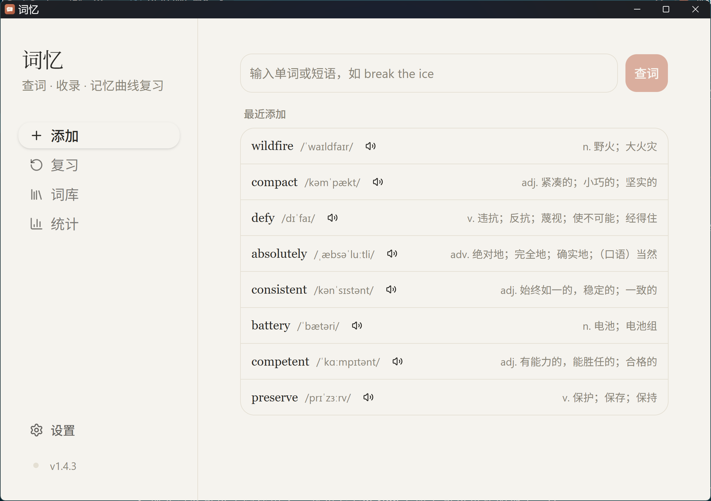
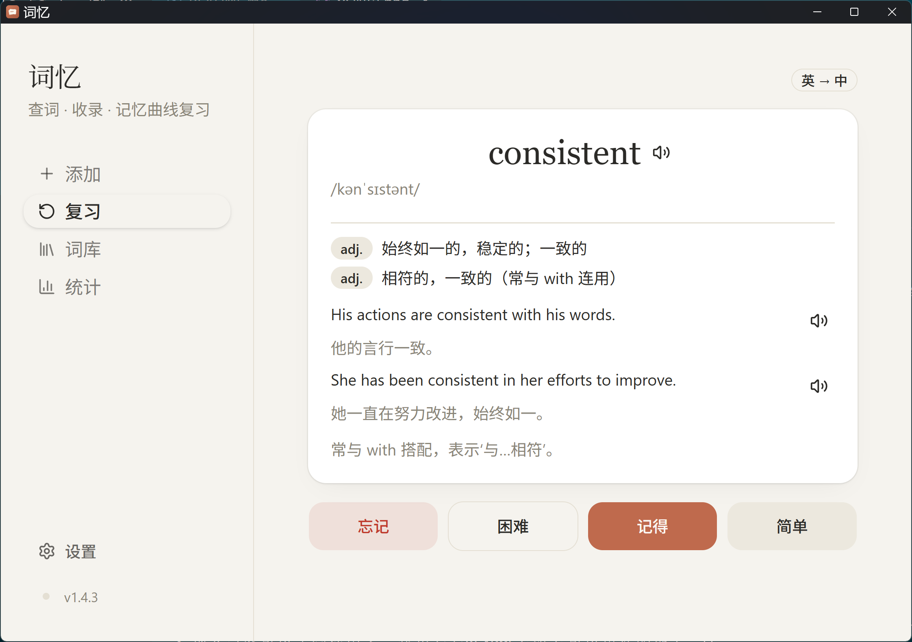
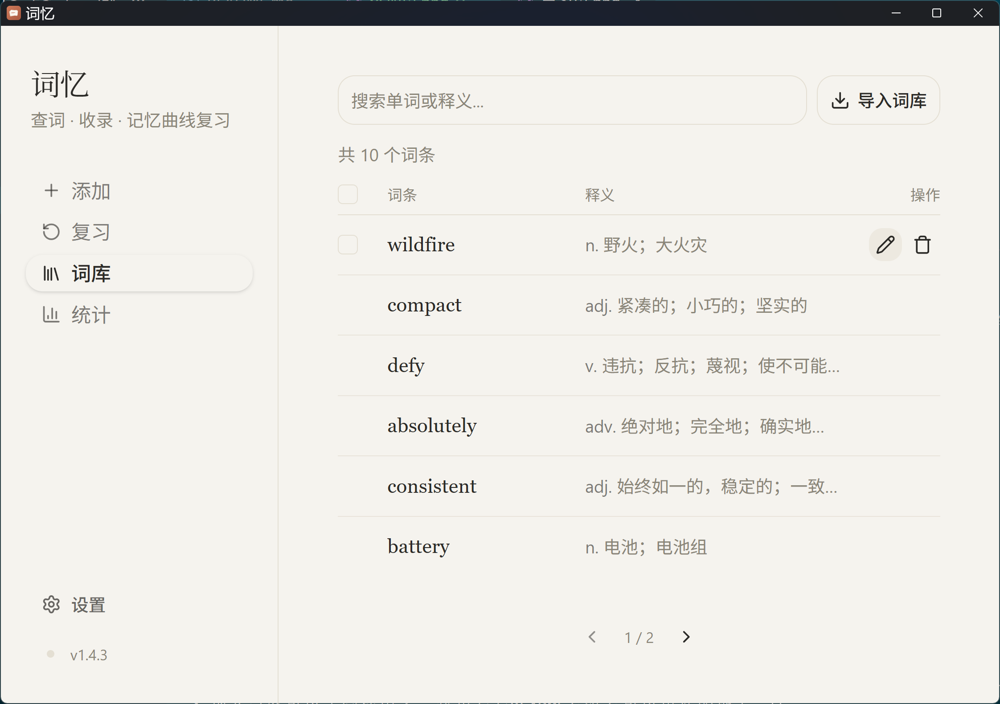
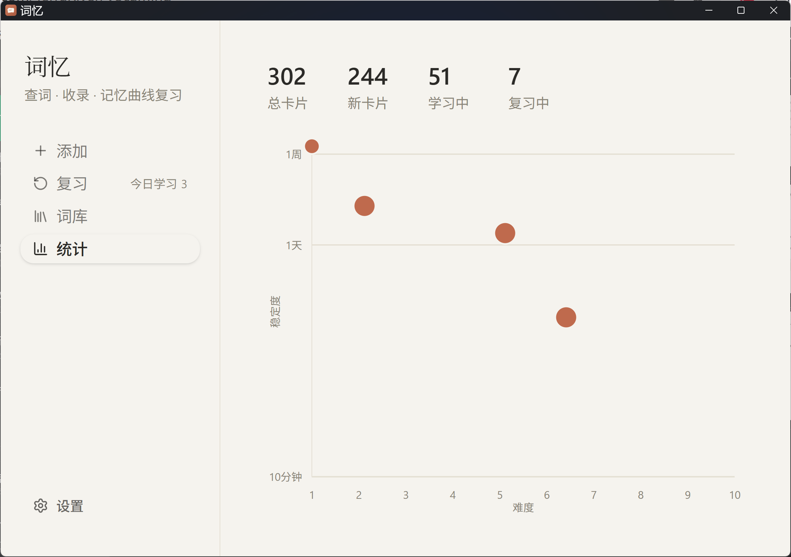
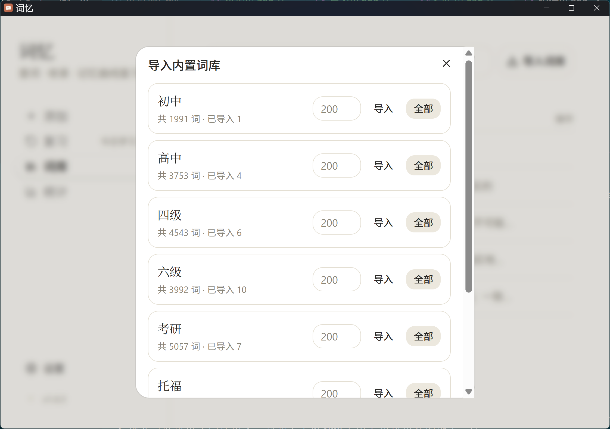

# 词忆

一个自用的 Windows 桌面单词学习工具，基于 Tauri 2 + React 19 + TypeScript 构建。用大模型查词、收录生词，用本地 sherpa-onnx 引擎朗读发音，并用 FSRS 记忆算法安排复习，帮助按记忆曲线巩固词汇。

## 下载

前往 [Releases](https://github.com/TerraRiver/VocaMind/releases) 下载最新安装包，当前最新版本 [v1.4.3](https://github.com/TerraRiver/VocaMind/releases/tag/v1.4.3)。Windows 桌面应用，NSIS 安装包，下载后直接安装运行。

## 截图

<table>
  <tr>
    <td align="center"><br>查词收录</td>
    <td align="center"><br>记忆曲线复习</td>
  </tr>
  <tr>
    <td align="center"><br>词库管理</td>
    <td align="center"><br>学习统计</td>
  </tr>
  <tr>
    <td align="center"><br>内置词表导入</td>
    <td></td>
  </tr>
</table>

## 功能

- **查词收录**：输入单词或短语，调用大模型（OpenAI 兼容接口）一次性返回音标、词性、释义、变形、例句、用法说明等内容；查词结果以可编辑表单展示，保存前可手动修正 AI 的错误，也可以填写个人助记笔记。若查询的词已在词库中，会直接从本地读取，不重复调用大模型。「添加」页在空闲时会展示最近收录的词条。
- **本地发音**：单词发音由内置的 [sherpa-onnx](https://github.com/k2-fsa/sherpa-onnx) 神经网络 TTS 引擎在本地合成（作为独立子进程运行，不依赖网络），使用 Piper 的 ljspeech 语音模型，效果明显好于系统自带语音；中文例句/释义仍使用浏览器 Speech Synthesis 朗读。合成结果按文本哈希缓存，重复播放同一词不会重新合成。若本地发音引擎异常，会自动回退到系统语音并提示。
- **记忆曲线复习**：基于 [ts-fsrs](https://github.com/open-spaced-repetition/ts-fsrs)（FSRS 算法，Anki 现行默认算法）安排复习计划，复习队列自动补充，并记录每日复习量。支持「重来 / 困难 / 良好 / 简单」四档打分。默认按「英译中」方向复习，添加单词时勾选「双向」可额外生成一张独立排期的「中译英」卡片。
- **词库管理**：分页浏览已收录单词，支持搜索、多选批量删除、单条编辑与删除。表格按重要性响应式收起列（窄屏下依次隐藏状态、释义，词条与操作始终完整显示），不会出现滚动条。
- **词表导入**：内置初中、高中、四级、六级、考研、托福、SAT 乱序词表，可选择数量批量查词导入。
- **学习统计**：查看总卡片数、新卡片/学习中/复习中的分布，以及难度-稳定度散点图。
- **模型设置**：可在设置中配置 Base URL / API Key / Model，默认使用 DeepSeek 官方 API，同样支持任意 OpenAI 兼容接口（如本地 Ollama）。

## 技术栈

- [Tauri 2](https://tauri.app/)（Rust 外壳，Windows 桌面打包）
- React 19 + TypeScript + Vite 7
- Tailwind CSS v4 + shadcn/ui（Nova 预设），词库表格使用 CSS 容器查询实现响应式布局
- SQLite（通过 `tauri-plugin-sql` 本地存储单词与复习卡片）
- [`ts-fsrs`](https://github.com/open-spaced-repetition/ts-fsrs) 实现间隔重复调度
- [sherpa-onnx](https://github.com/k2-fsa/sherpa-onnx) 本地神经网络 TTS，通过独立子进程调用（详见下方「第三方资源」）
- LLM 请求通过 `@tauri-apps/plugin-http` 转发，避开 WebView 的 CORS 限制

## 数据存储

单词与释义存于 `words` 表（`detail_json` 保存结构化释义），每个单词对应一张或两张（双向时）复习卡片存于 `cards` 表，字段与 `ts-fsrs` 的 `Card` 结构一一对应。开发环境下数据库文件位于：

```
%APPDATA%\com.terrariver.englishbook\app.db
```

sherpa-onnx 合成的发音按文本哈希缓存于：

```
%TEMP%\english-book-tts-cache\
```

## 第三方资源

`src-tauri/resources/sherpa/` 打包了本地发音功能所需的静态资源，运行时作为独立子进程调用，不链接进应用本体：

- `sherpa-onnx-offline-tts.exe` 及配套 DLL：[k2-fsa/sherpa-onnx](https://github.com/k2-fsa/sherpa-onnx) v1.13.5（Apache-2.0），静态链接了 espeak-ng 用于音素转换；沿用之前 Piper 的做法，把这部分隔离在独立子进程里调用，让 espeak-ng 的 GPL-3 代码不会成为编译后应用本体的一部分
- `espeak-ng-data/`：随上述版本附带的音素转换数据（espeak-ng，GPL-3.0，仅按原样打包并以独立可执行文件形式调用）
- `voices/en_US-ljspeech-medium.onnx`、`voices/tokens.txt`：来自 [rhasspy/piper-voices](https://huggingface.co/rhasspy/piper-voices) 的音色模型（MIT），由 sherpa-onnx 项目重新打包以适配其 VITS 后端；训练自公有领域的 [LJ Speech Dataset](https://keithito.com/LJ-Speech-Dataset/)

详见该目录下的 `THIRD_PARTY_NOTICES.txt`。

`src/data/wordlists/` 下内置的初中、高中、四级、六级、考研、托福、SAT 词表数据来自 [KyleBing/english-vocabulary](https://github.com/KyleBing/english-vocabulary)。

## 开发

克隆仓库前需先安装 [Git LFS](https://git-lfs.com/)（`git lfs install`）：`src-tauri/resources/sherpa/` 下的语音模型与二进制文件通过 LFS 存储，普通 clone/checkout 只会拿到指针文件。

```bash
npm install
npm run dev        # 启动前端开发服务器
npm run tauri dev  # 启动 Tauri 桌面开发模式
```

## 构建

```bash
npm run build
npm run tauri build
```

首次使用前需在左侧导航「设置」中填写大模型 API Key，才能进行查词与词表导入。
